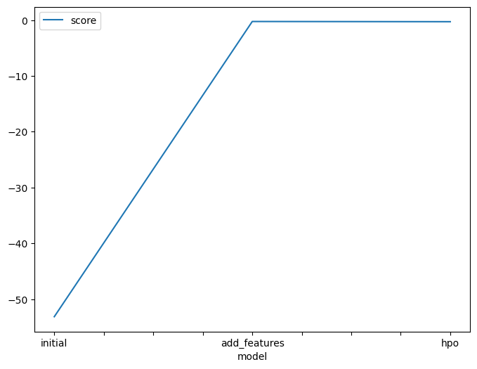
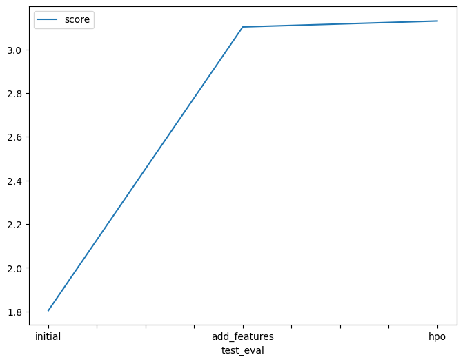

# Report: Predict Bike Sharing Demand with AutoGluon Solution
#### Lynda Lebdjiri

## Initial Training
### What did you realize when you tried to submit your predictions? What changes were needed to the output of the predictor to submit your results?

Upon submitting the initial predictions, it was found that the output of the predictor was already in the correct format for submission. Specifically, a check was performed to ensure there were no negative values in the predictions, as negative values would not be valid in the context of bike rental counts. The check confirmed that there were indeed no negative values. Therefore, no changes were needed to the output of the predictor before submission. This process underscored the importance of validating the predictions to ensure they align with the problem’s constraints and real-world scenarios.

### What was the top ranked model that performed?

The top-ranked model that performed the best in the  training was the WeightedEnsemble_L3 model. This model achieved the best score of -53.13 on the Root Mean Squared Error (RMSE) evaluation metric. It indicates that this model had the most accurate predictions among all the models trained. 

## Exploratory data analysis and feature creation
### What did the exploratory analysis find and how did you add additional features?

During the exploratory data analysis phase, each feature’s distribution was visualized and outliers in the count feature were identified. A correlation heatmap was also created to understand the relationships between different features, providing valuable insights into the data.

Additional features were added from the datetime column in both the training and testing datasets. These new features, namely year, month, day, and hour, were created to capture potential time-related patterns in the bike rental counts, such as daily or seasonal trends.

The season and weather features were mapped to their respective categories and converted to category type. This ensured that these features were treated as categorical variables during model training, recognizing that they represent distinct categories rather than numerical values.

Preprocessing steps were also applied to improve the performance of the models. A log transformation was applied to the count feature to handle skewness in the data, and the Interquartile Range (IQR) method was used to remove outliers from the count feature. These steps can help reduce the impact of extreme values and make the data more normally distributed.

### How much better did your model preform after adding additional features and why do you think that is?

The model’s performance improved significantly after adding additional features and preprocessing the data. This is evident from the Root Mean Squared Error (RMSE) values. Before the addition of new features and preprocessing, the best RMSE score was -53.130768. However, after these steps, the best RMSE improved to -0.243425.

The improvement can be attributed to the additional features and preprocessing steps providing more relevant and well-structured information for the model to learn from. For instance, decomposing the datetime column into year, month, day, and hour likely helped the model capture time-related patterns in the data, such as daily or seasonal trends in bike rentals. Similarly, mapping season and weather to their respective categories ensured that these features were treated as categorical variables, which could better represent their relationship with the target variable. Furthermore, applying a log transformation to the count feature and removing outliers helped make the data more normally distributed, which is beneficial for many machine learning algorithms.

## Hyper parameter tuning
### How much better did your model preform after trying different hyper parameters?

The process of hyperparameter tuning led to a noticeable enhancement in the model’s performance. The best model, identified as WeightedEnsemble_L3, demonstrated this improvement. The Root Mean Squared Logarithmic Error (RMSLE), fell from -0.243425 to -0.278787. This decrease in RMSLE is indicative of the model’s predictions becoming more accurate post the optimization of hyperparameters. The tuning process involved adjusting the hyperparameters for various models, including GBM, RF, and KNN. This adjustment likely enabled the model to more effectively capture complex patterns in the data, thereby boosting its performance.

### If you were given more time with this dataset, where do you think you would spend more time?

There's definitely room for improvement on this model, and with some extra time, we could make some tweaks. Here's what I would focus on:

Feature Engineering: We've already extracted features from the datetime data, but there's more to uncover. For instance, considering "rush hour," "weekend vs. weekday," or "school holidays." could potentially improve the model as these factors might influence bike rental demand.

Model Selection and Hyperparameter Tuning : is another area where more time could be beneficial. While the current approach uses a variety of models and conducts hyperparameter tuning, there might be other algorithms or hyperparameters that could yield better results.

Ensemble Methods : Combining predictions from multiple models often outperforms individual models. Techniques like stacking, bagging, and boosting could be explored to create an even more accurate picture of rental demand.

Data Refinement: Currently, we use the IQR method for outlier detection. However, other methods might be more effective. By refining our data cleaning techniques, we can ensure the model is working with the most reliable information.

### Create a table with the models you ran, the hyperparameters modified, and the kaggle score.

|model|hpo1|hpo2|hpo3|score|
|--|--|--|--|--|
|initial|time_limit=600|presets=best_quality|GBM.num_boost_round=100|1.80433|
|add_features|time_limit=600|presets=best_quality|RF.n_estimators=200|3.10323|
|hpo|time_limit=600|presets=best_quality|KNN.weights=distance|3.13007|

### Create a line plot showing the top model score for the three (or more) training runs during the project.

### Create a line plot showing the top kaggle score for the three (or more) prediction submissions during the project.

## Summary

**Phase 1: Initial State**
- Imported necessary libraries and loaded the train, test, and sample submission data.
- Converted the `datetime` column in both the training and testing datasets to datetime type.
- Trained the model using AutoGluon's `TabularPredictor` with the label set to "count" and the evaluation metric set to "root_mean_squared_error". Ignored the "casual" and "registered" columns during training.
- Generated predictions on the test set, checked for any negative values in the predictions and set them to zero.
- Saved the predictions to a CSV file and submitted it to the Kaggle competition.

**Phase 2: Adding Additional Features and Preprocessing**
- Performed exploratory data analysis by creating histograms for each feature in the train dataset and a box plot for the 'count' feature to check for outliers. Also created a correlation heatmap of the train data.
- Created new features 'year', 'month', 'day', and 'hour' from the 'datetime' column in both the train and test datasets.
- Created mappings for 'season' and 'weather' based on the provided descriptions and converted these features to category type in both datasets.
- Applied a log transformation to the 'count' feature in the train dataset and removed outliers using the IQR method.
- Checked for null values and duplicated values in both datasets.
- Retrained the model with the same settings as before, but with more features.

**Phase 3: Hyperparameter Tuning**
- Defined a dictionary of hyperparameters for GBM, RF, and KNN models. Also defined the number of trials, scheduler, and searcher for hyperparameter tuning.
- Retrained the model with the same settings as before, but with hyperparameter tuning.

In each phase, the model’s performance improved due to the additional features, preprocessing steps, and hyperparameter tuning applied. The work done in each phase led to a significant improvement in the model’s performance.
